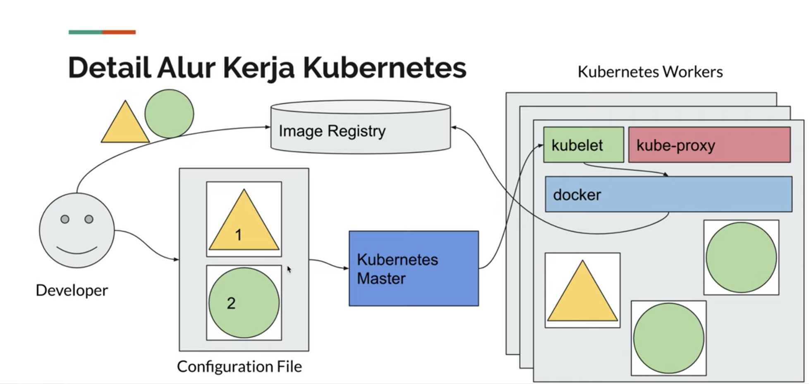
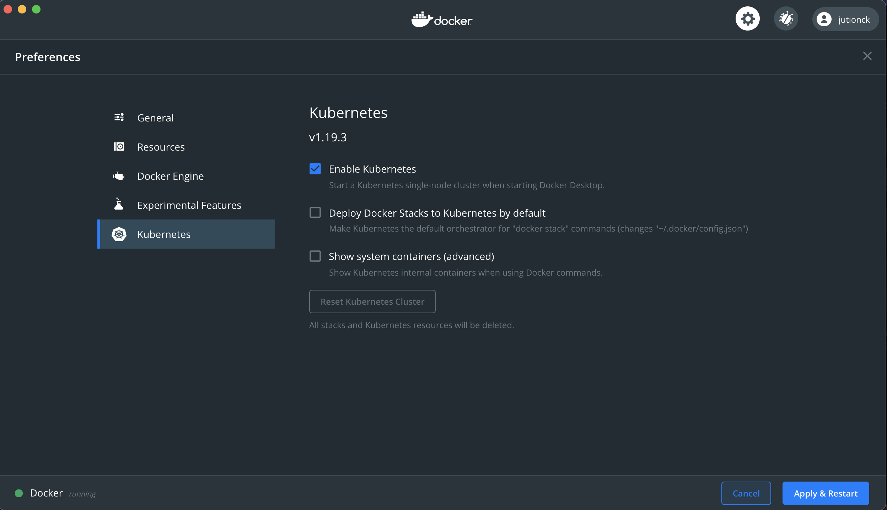
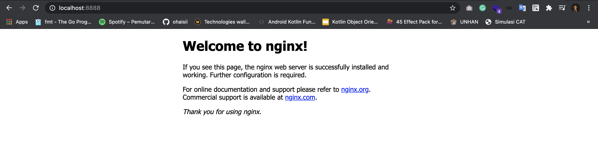

## Belajar Kubernetes

#### Kenalan
**Kubernetes** di perkenalkan pada tahun 2014 oleh google, kubernetes sendiri adalah aplikasi untuk automation scaling di production, mudahnya manajemen container. Kubernetes ini open source ya
jadi bisa di gunakan secara gratis.

#### Proses Kubernetes

sumber: https://miro.medium.com/max/3232/1*geWhD3uPkYESmA8jKb9jEQ.png

Konfigurasi kubernetes tidak terlalu rumit di banding kita mengkonfigurasikan pada docker.
Pada kubernetes kita cukup buat 1 buah configuration file lalu upload ke kubernetes dan dari kubernetes itu sendiri akan
otomatis di buatkan oleh workers.

#### Arsitektur Kubernetes

sumber: https://d33wubrfki0l68.cloudfront.net/518e18713c865fe67a5f23fc64260806d72b38f5/61d75/images/docs/post-ccm-arch.png

Keterangan:<br>
***Bagian Kubernetes Master***
1. Kube-apiserver, sebuah API untuk berinteraksi dengan kubernetes Cluster
2. etcd adalah sebuah database sebagai penyimpanan di kubernetes master
3. kube-scheduler management apalikasi dan sebagai request node untuk menjalankan aplikasi
4. kube-controller manager sebagai pengontrol di kubernetes cluster
5. cloud-controlle manager sebagai kontrol interaksi terhadap layanan cloud provider

***Bagian Kubernetes Nodes***
1. kubelet berjalan di setiap node dan bertugas untuk memastikan aplikasi berjalan di Node (pasangannnya kube-controller)
2. kube-proxy berjalan di setiap node, bertugas sebagai pe proxy-an server
3. container-manager berjalan di setiap node, sebagai container manager

Jadi jika di gambarkan:

sumber: https://youtu.be/LcJi3WCR_T8?list=PL-CtdCApEFH8XrWyQAyRd6d_CKwxD8Ime&t=635

#### Instalasi Kubernetes di Local
Ada 2 cara untuk instalasi kubernetes di local komputer kita:
1. Menggunakan Docker Desktop<br>
    Untuk cara ini, cukup simple baik di windows maupun di mac, yaitu cukup
    buka pengaturan atau preference di logo docker yang aktif, kemudia ceklis bagian kubernetes
    
    
2. Menggunakan Minukube (ini membutuhkan tool tambahan Virtual Box)<br>
    Untuk cara kedua ini, terlebih dahulu kita download dan install virtual box, link download disini: https://www.virtualbox.org/wiki/Downloads
    sesuaikan dengan OS yang kalian miliki. Selanjutnya kita download minikube disini https://minikube.sigs.k8s.io/docs/start/
3. Install tool sebagai komunikasi antara Kubernetes Master dan Kubernetes Node, aplikasi yang digunakan adalah Kubectl, link disini https://kubernetes.io/docs/tasks/tools/install-kubectl/  

Setelah semua nya terdownload dan install, buka terminal, kita jalankan minikube nya dengan cara:
```
time minikube start
```
Tunggu hingga proses selesai, biasanya untuk pertama kali membutuhkan waktu lama.
Informasi nya seperti ini:
```
➜  ~ time minikube start
😄  minikube v1.15.1 on Darwin 11.0.1
✨  Using the docker driver based on existing profile
👍  Starting control plane node minikube in cluster minikube
🚜  Pulling base image ...
💾  Downloading Kubernetes v1.19.4 preload ...
    > preloaded-images-k8s-v6-v1.19.4-docker-overlay2-amd64.tar.lz4: 486.35 MiB
🤷  docker "minikube" container is missing, will recreate.
🔥  Creating docker container (CPUs=2, Memory=2200MB) ...
🐳  Preparing Kubernetes v1.19.4 on Docker 19.03.13 ...
🔎  Verifying Kubernetes components...
🌟  Enabled addons: storage-provisioner, default-storageclass
🏄  Done! kubectl is now configured to use "minikube" cluster and "default" namespace by default
minikube start  27.93s user 32.69s system 3% cpu 26:10.69 total
```
Kemudian kita jalankan ini untuk mengecek sudah benar-benar berjalan belum:
```
kubectl version
```
Harusnya akan seperti ini, yang perlu di catat adalah Client Version dan Client Server nya
```
Client Version: version.Info{Major:"1", Minor:"19", GitVersion:"v1.19.3", GitCommit:"1e11e4a2108cb2912226cedeafd99df", GitTreeState:"clean", BuildDate:"2020-10-14T12:50:19Z", GoVersion:"go1.15.2", Compiler:"gc", Platform:"darwin/amd64"}
Server Version: version.Info{Major:"1", Minor:"19", GitVersion:"v1.19.4", GitCommit:"d360454cc52d1867af5491dc9c5f", GitTreeState:"clean", BuildDate:"2020-11-11T13:09:17Z", GoVersion:"go1.15.2", Compiler:"gc", Platform:"linux/amd64"}
```

Sampai disini harusnya sudah selesai.

#### Kenal Lebih Dalam dengan Kubernetes
1. **Node**<br>
    Istilah penting pada kubernetes adalah **Node**, Node adalah sebuah **Worker Machine** kubernetes, node ini bisa dalam bentuk
    VM atau mesin fisik, didalam Node terdapat 3 bagian (kubelet,kube-proxy,container manager)
    
    Cek Node yang ada dengan cara:
    ```
    kubectl get node
    ```
    Detail Node:
    ```
    kubectl describe node namanode
    ```
2. **Pod**<br>
    Unit terkecil yang bisa di deploy di Kubernetes, pod adalah tempat container, dalam 1 pod bisa terdiri dari 1 atau lebih container.
    Nah Pod ini yang akan di running di Kubernetes Cluster. Pod untuk kebutuhan scaling.
     
    Cek Pod yang ada dengan cara:
    ```
    kubectl get pod
    ```
    Detail Pod:
    ```
    kubectl describe pod namapod
    ```
   
   ***Cara Membuat Pod***<br>
   Untuk file pod biasanya di buat dengan file yang berekstensikan .yaml.
   Sebelum membuat pod usahakan sudah mempunyai image dan container ya (di docker tentunya), dan container jangan lupa di start
   ```
    apiVersion: v1
    kind: Pod
    metadata:
      name: nginx
    spec:
      containers:
        - name: nginx
          image: nginx
          ports:
            - containerPort: 80
    ```
   Untuk mengeksekusinya:
   ```
    kubectl create -f filepod.yaml
    ```
   Jika berhasil:
   ```
    pod/namapod created
    ```
   Kalo gagal:
   ```
    error: error validating "nginx.yaml": error validating data: ValidationError(Pod.spec.containers[0].ports[0]): invalid type for io.k8s.api.core.v1.ContainerPort: got "string", expected "map"; if you choose to ignore these errors, turn validation off with --validate=false
    ```
   
   ***Port Forwarding***
   Kita dapat memforward sebuah port jika kita ingin mengakses sebuah container, disini misal kita ingin memforward port dari nginx semula :80 kita
   forward menjadi :8888, caranya:
   ```
    kubectl port-forward namapod 8888:8080
    ``` 
   Uji coba di browser dengan mengetikkan `localhost:8888` jika berhasil:
    
   
   
Referensi:
https://www.youtube.com/playlist?list=PL-CtdCApEFH8XrWyQAyRd6d_CKwxD8Ime
